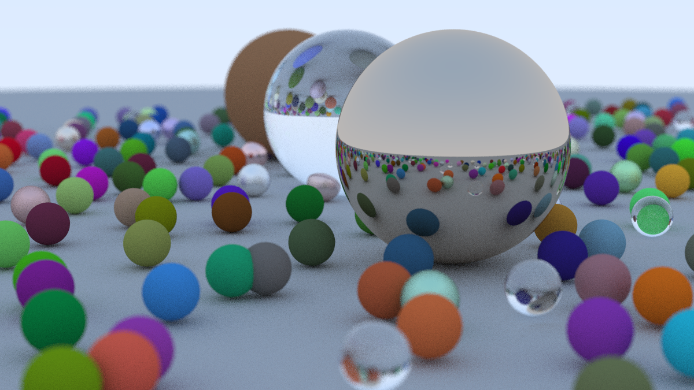

# raytracer
Basic raytracer in C#, built while following the book [_Ray Tracing in One Weekend_](https://raytracing.github.io/books/RayTracingInOneWeekend.html) and chapter 4  of [_Ray Tracing: The Next Week_](https://raytracing.github.io/books/RayTracingTheNextWeek.html).
It renders scenes to a plain-text PPM (P3) image written to stdout.

## Setup
1. Have .NET 9 SDK (`net9.0`)
2. Clone this repo:
    ```
    git clone git@github.com:Kezak1/raytracer.git
    cd raytracer
    ```
3. To run the program, you can either:

    from the repo root:
    ```
    dotnet run --project raytracer > image.ppm
    ```
    
    or from the project directory:
    ```
    cd raytracer
    dotnet run > image.ppm
    ```

    It writes progress logs to stderr and the final image to stdout.

## Examples
After running the unchanged program you should something similar to this:


 
## Customization
To customize the image you can edit the function `CreateFinalScene()` in `Program.cs`. You can add objects/materials and tweak camera settings like `ImageWidth`, `SamplesPerPixel`, `MaxDepth`, `VFov`, `DefocusAngle`, `FocusDist`, `LookFrom`, and `LookAt`.

## View the output
To convert to PNG with you can use ImageMagick:
```
magick image.ppm image.png
```


